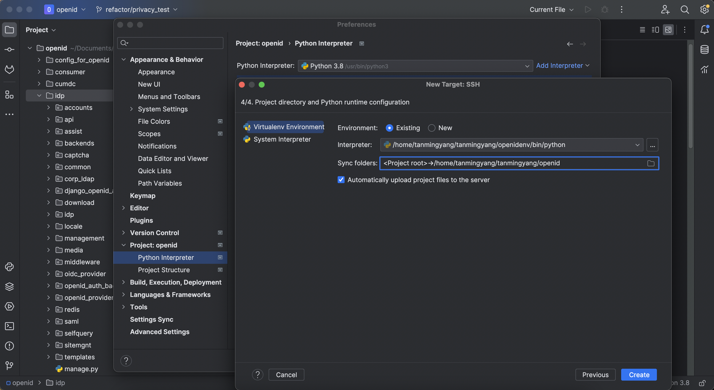
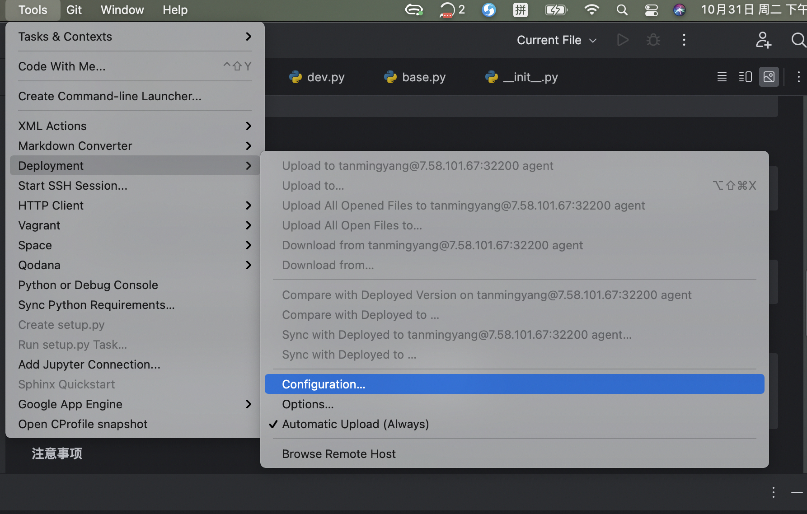

## 背景
有一些老旧项目，环境无法兼容，所以需要在开发机上部署，并采用虚拟环境进行隔离。本文记录如何本地开发代码，部署至开发机上运行。

## 开发机准备
1. 登录开发机：ssh xxx@{ip} -p 32200
2. 创建个人目录：mkdir xxx & cd xxx
3. 创建虚拟环境并指定python版本：virtualenv openidenv --python=python2.7
4. 进入虚拟环境：source openidenv/bin/activate
5. 创建运行文件夹：cd openidenv && mkdir xxx
6. 退出虚拟环境：deactivate

### pyenv
pyenv会安装不同版本的python，并且可以自动切换。并且自带pyenv-virtualenv,可以方便的创建虚拟环境。

例如:

```bash
pyenv virtualenv 3.7.9 openidenv
// 激活环境
pyenv activate openidenv
// 退出环境
pyenv deactivate
```

以上命令创建了一个3.7.9的虚拟环境,并且激活了该虚拟环境。比virtualenv更方便，因为virtualenv需要先行安装对应版本的python，再创建虚拟环境。

## pycharm远程推送代码（pycharm专业版）
1. 打开本地项目
2. 选择preference -> project -> python interpreter -> add interpreter -> on ssh
3. 填写远程机器信息
4. virtualenv enviroment：
    ```txt
        Enviroment：Existing
        interpreter：选择开发机上的虚拟环境下的 /bin/python
        sync folders：选择开发机上创建的运行文件夹（同步目录）
    ```
5. 勾选Automatically upload（文件改动自动上传）
6. 等待上传完毕



## 切换分支有时候需要手动推送
1. tools -> deployment -> upload to xxx@{ip} agent

