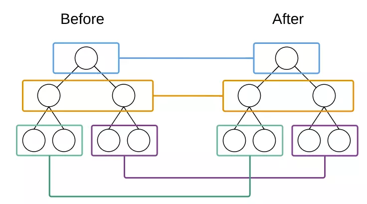
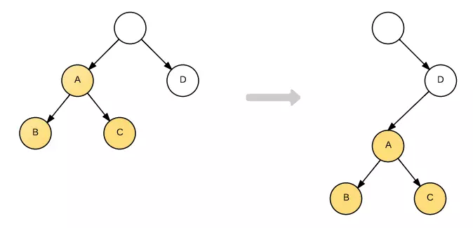
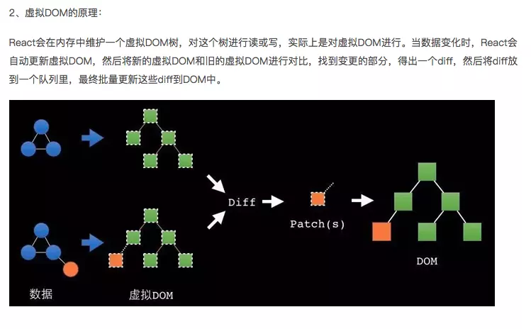

## diff算法

### 来回顾一下dom树构建
1.使用HTML分析器，根据HTML元素构建dom树 
2.根据CSS分析器，根据CSS文件和内联样式，生成样式表 
3.根据dom树和样式表生成render树 
4.当dom元素发生改变的适合，重复以上步骤

### 什么是虚拟dom
虚拟dom是在内存里维护的数据结构，当真正插入文档中的适合才会变成dom

### 为什么需要虚拟dom
1.假设使用JQuery直接对dom操作，那么每次操作都会导致重新构建render树，会造成不必要的性能损耗 
2.虚拟dom可以根据更新记录，分析出多次更新后的最终的结果，一次性更新到dom树上 

## 什么是diff
传统 diff 算法通过循环递归的方法对节点进行操作，算法复杂度 为O(n3)，React 通过制定大胆的策略，将 O(n3)的时间复杂度转换成 O(n)

### react中的diff算法是如何进行的
1.在react中使用逐层进行节点比较，来查找任意两颗树之间最少修改数，使用逐层比较，每个节点只需要访问一次，使得时间复杂度降低为O(n) 
2.React只会简单的考虑同层节点的位置变换，对于不同层的节点，只会简单的创建和删除 
3.通过key标识列表节点，在更新节点时知道更新的节点位置

### react 的 diff 原理
1. Web UI 中 DOM 节点跨层级的移动操作特别少。可以忽略不计。
2. 拥有相同类的两个组件将会生成相似的树形结构，拥有不同类的两个组件将会生成不同的树形结构。
3. 对于同一层级的一组子节点，它们可以通过唯一 id 进行区分。

### 虚拟dom和diff算法结合
通过操作虚拟dom一次性更新dom树，结合diff算法找到改动位置，实现最小更新 

### 参考资料
[参考](https://www.jianshu.com/p/55e67e8739f6) 
[参考](https://www.jianshu.com/p/21a445066d51?from=timeline)