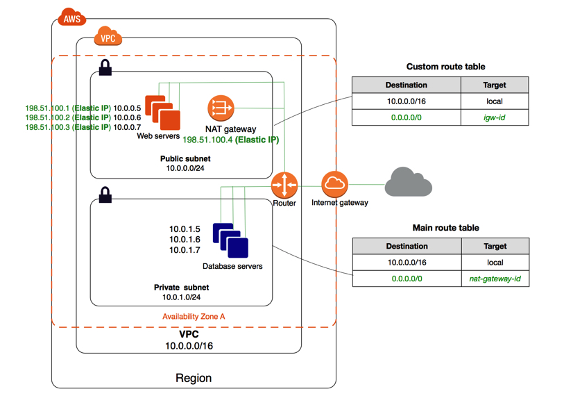

## 什么是云
云服务是基于“云计算”技术，实现各种终端设备之间的互联互通。简单地说，未来不管是手机还是电视机，都只是一个单纯的显示和操作终端，它们不再需要具备强大的处理能力。用户享受的所有资源、所有应用程序全部都由一个存储和运算能力超强的云端后台来提供。

通过使计算分布在大量的分布式计算机上，而非本地计算机或远程服务器中，企业数据中心的运行将更与互联网相似。这使得企业能够将资源切换到需要的应用上，根据需求访问计算机和存储系统。

## 亚马逊云（AWS）
以亚马逊云为例子讲述各大名词含义

### 区域（region）
部署了AWS服务的地理地区。同region下共用部分网络资源，内网访问流量不收取费用

### 可用区域（AZ/Avaliability Zone）
region下多个相互隔离的区域，部署计算资源与数据。可部署多AZ架构保证高可用

### EC2
实例

### VPC
VPC即Virtual Private Cloud，虚拟私有网络，是一个虚拟出来的类似数据中心传统网络的网络资源，在其中可以创建一些计算资源以及网络资源。

定义在Region之下的。它在逻辑上与 AWS 云中的其他虚拟网络隔绝，可以为 VPC 指定 IP 地址范围、添加子网、关联安全组以及配置路由表。

在VPC之下面还有子网资源，创建子网资源是需要指定AZ的，所以在同一个区域内，VPC和AZ两个资源在逻辑上是相互交叉的。一个VPC下，有多个子网以及位于子网的实例资源，这些可能分布在不同的可用区；一个可用区内，有多个属于不同VPC的子网以及实例资源。

可以认为，AZ实现了地理位置上的隔离，VPC提供了网络上的隔离。

VPC基本组件
#### EIP

1. 弹性IP是AWS公网IP池里面的IP，"弹性"体现在IP取消与实例取消关联后，不会被释放到AWS公网IP池中，是用户的资源，可以再次绑定。

2. 借助 EIP，可以快速将地址重新映射到您的账户中的另一个实例，从而屏蔽实例故障。

3. EIP 实际位于互联网网关（IGW）上，通过 NAT 方式映像到了被绑定 EC2 实例的网卡上。

#### 路由表（Route Table）
路由表是VPC内的资源，与子网进行绑定，一个子网只可以绑定一张路由表，不同的子网可以绑定同一张路由表。

路由表中的每个路由指定一个目的地和一个目标。例如，要使子网能够通过互联网网关访问 Internet，需要将以下路由添加到子网路由表中。

|  目的地   | 目标  |
|  ----  | ----  |
| 0.0.0.0/0  | igw-12345678901234567 |

#### 因特网网关（IGW）
Internet 网关是一种横向扩展、支持冗余且高度可用的 VPC 组件，可实现 VPC 中的实例与 Internet 之间的通信。

#### NAT网关
NAT（Network Address Translation，网络地址转换）是将IP 数据包头中的IP 地址转换为另一个IP 地址的过程。从定义上讲，SNAT是原地址转换，DNAT是目标地址转换。

网络地址转换，它是一种把内部私有网络地址（IP地址）翻译成合法网络IP地址的技术。

1. 使用NAT网关可以允许私有子网中的实例连接到Internet或其他AWS用户，但阻止Internet发起与这些实例的连接。

2. 每个 NAT 网关只能关联一个弹性 IP 地址。创建弹性 IP 地址后，无法解除该地址与 NAT 网关的关联。如果需要为 NAT 网关使用不同的弹性 IP 地址，则必须创建具有所需地址的新 NAT 网关，更新路由表，然后删除现有 NAT 网关 (如果不再需要)。

3. NAT 网关支持以下协议：TCP、UDP 和 ICMP。

4. 不能为 NAT 网关关联安全组。可以为私有子网中的实例使用安全组以便控制进出这些实例的流量。

5. 可以使用网络 ACL 控制进出 NAT 网关所在子网的流量。

#### ACL
访问控制列表(ACL)是一种基于包过滤的访问控制技术，它可以根据设定的条件对接口上的数据包进行过滤，允许其通过或丢弃。访问控制列表被广泛地应用于路由器和三层交换机，借助于访问控制列表，可以有效地控制用户对网络的访问，从而最大程度地保障网络安全。

### Subnet
Subnet即子网，是VPC下的资源

在Skyline系统实际业务中，有两个概念：

    1. Public Subnet: 子网下的计算资源可通过EIP，使用因特网网关，与公网互访。
    2. Private Subnet：子网下的计算资源无法使用EIP对外访问以及对外提供服务。

子网的网络访问特性是由与子网绑定的的路由表（Route Table）决定的